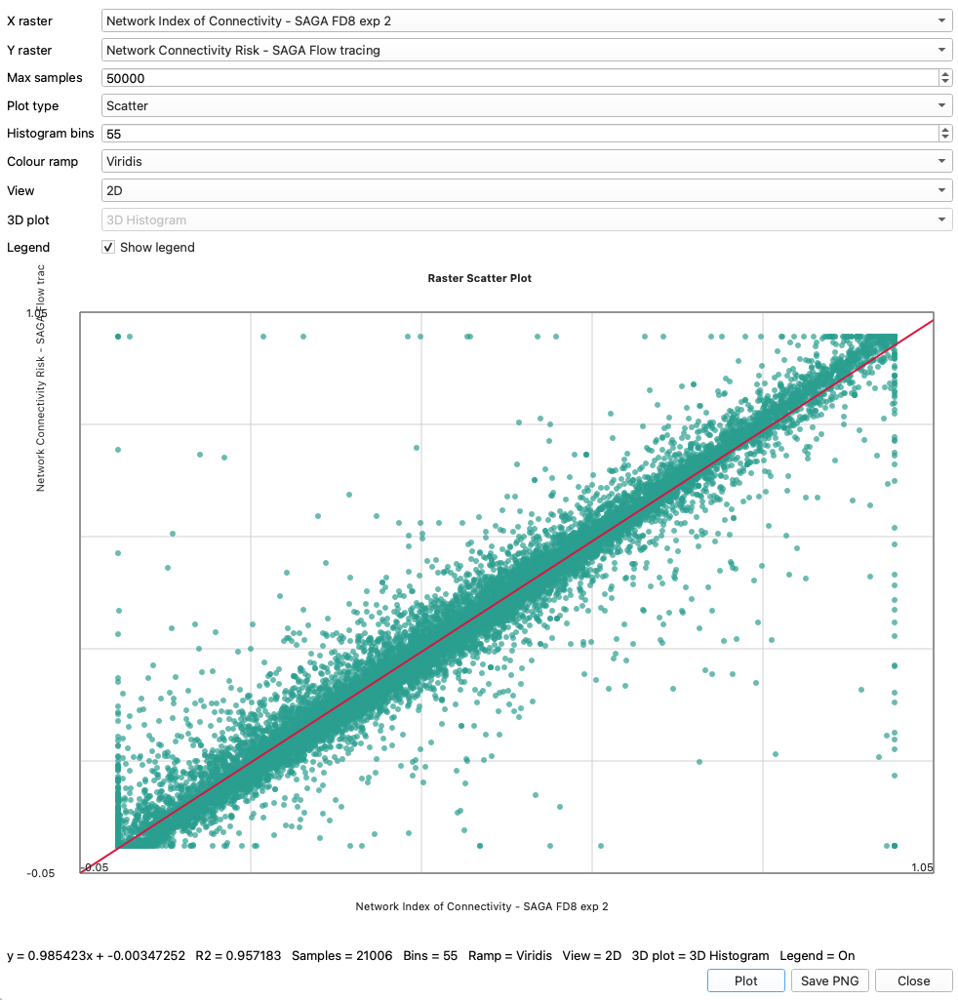
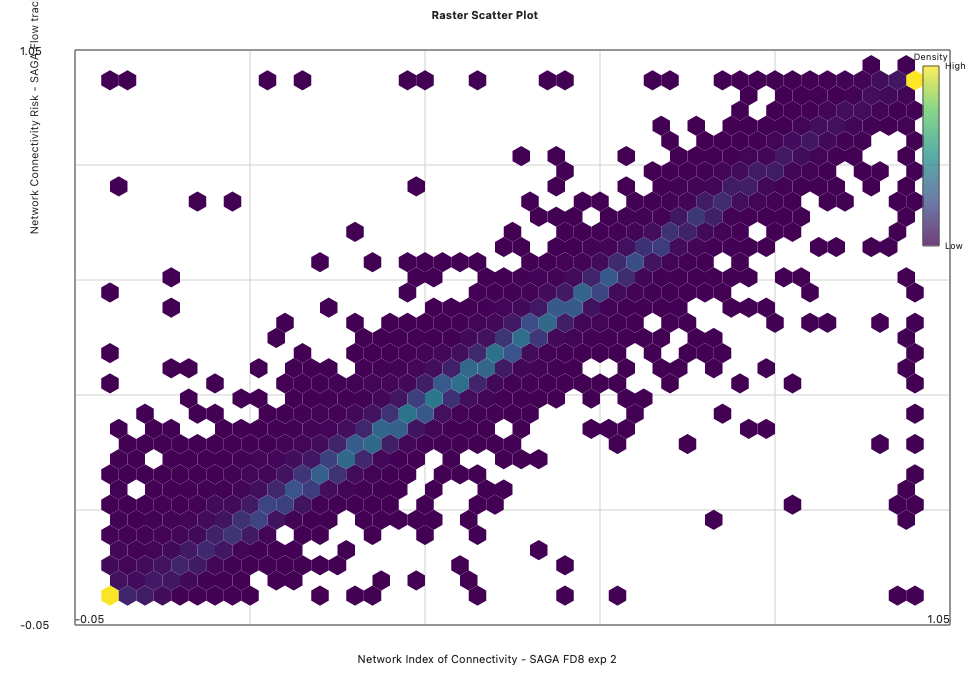
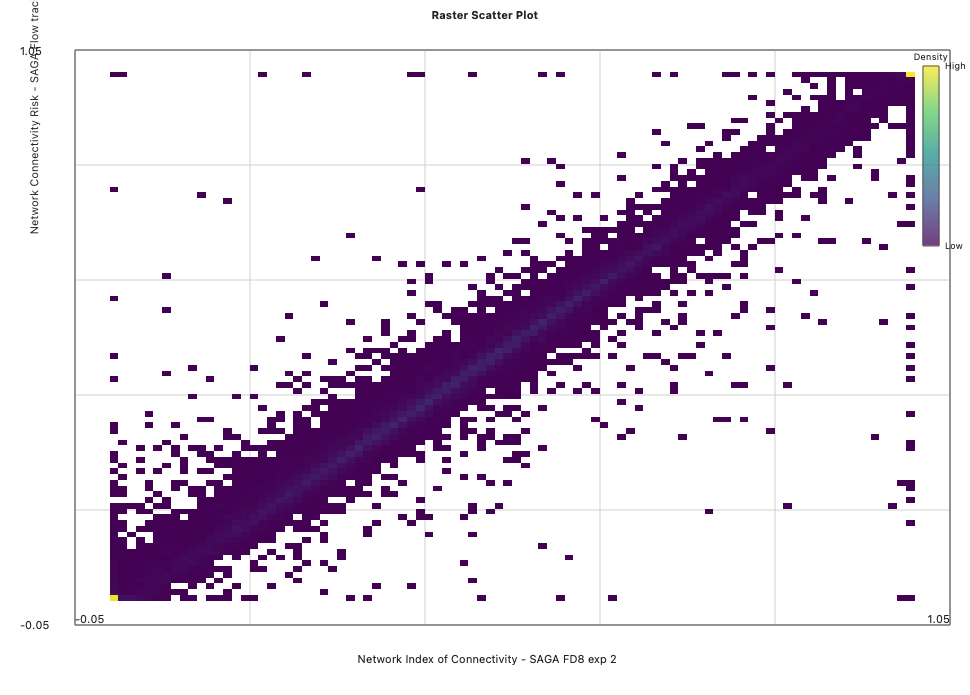
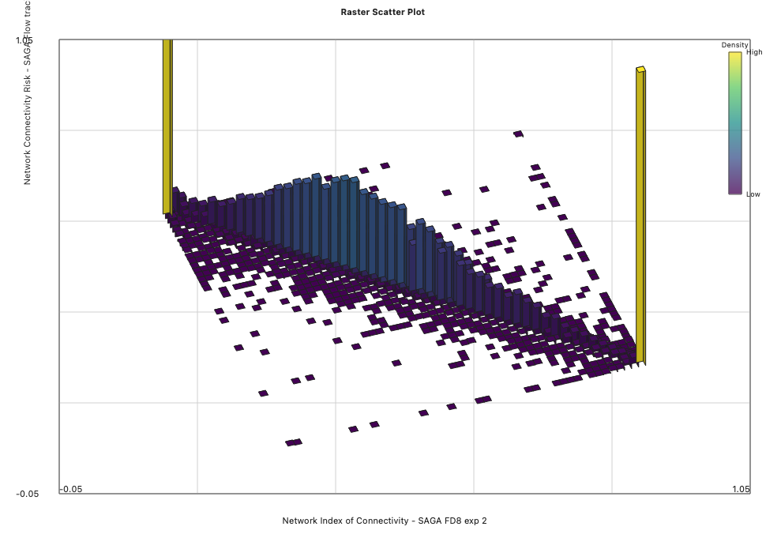

# Raster Scatter QGIS Plugin

This plugin opens a simple dialog that:

1. Lets you select two raster layers already loaded in the current QGIS project.
2. Samples the second raster at the cell centers of the first raster.
3. Draws a scatter plot, a 2D histogram (square or hex bins), or 3D views (histogram or scatter) of the paired values.
4. Lets you set histogram bin count and choose a colour ramp.
5. Includes a checkbox to toggle the colour legend on or off.
6. Lets you save the current figure as a PNG image.
7. Fits a linear regression and displays the equation and $R^2$ value.

## Screenshots

### User Interface and Scatter Plot

### 2D Histogram (Hexagon Bins)

### 2D Histogram (Square Bins)

### 3D Histogram

## Notes

- The plugin uses the first band of each raster.
- It samples on the grid of the X raster and transforms sample points into the Y raster CRS when needed.
- Large rasters are downsampled automatically so the plot stays responsive.
- 3D mode supports both a binned 3D histogram and a 3D scatter view.
- A color ramp legend is shown for density-based views.
- 3D views are interactive: drag with the left mouse button to rotate and use the mouse wheel to change vertical exaggeration.
- In 2D views, moving the mouse over the plot shows the current x/y coordinates (and bin count for histogram views).
- Toggling the legend checkbox refreshes the plot immediately.
- The plot uses Qt Charts from the QGIS runtime, so there is no separate matplotlib dependency.
- The code is written against `qgis.PyQt` imports so it can track QGIS 4+ / Qt 6 style APIs.

## Install

There are two ways to install this plugin:
1. Download the 'rasterScatter.zip' file from this repository and then use the 'Install from zip' function in the QGIS plugins dialogue.
2. Copy the repository folder into your QGIS plugin directory, then enable it from the Plugin Manager.

## Packaging

To distribute the plugin, zip the repository contents so the archive root contains `__init__.py`, `metadata.txt`, `raster_scatter.py`, `raster_scatter_dialog.py`, `icon.svg`, and optionally `resources.qrc`.
